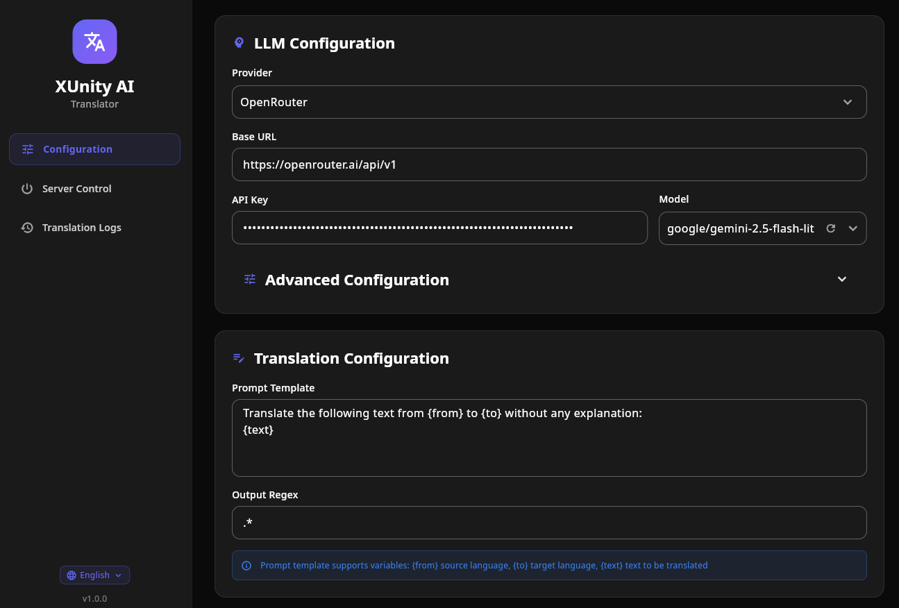

# XUnity AI Translator

用于 XUnity.AutoTranslator 的 LLM 翻译端点，提供图形化的配置界面。



## 用法

```ini
[Service]
Endpoint=CustomTranslate
FallbackEndpoint=

[General]
Language=zh
FromLanguage=ja

[Custom]
Url=http://127.0.0.1:8080/translate
EnableShortDelay=False
DisableSpamChecks=False
```